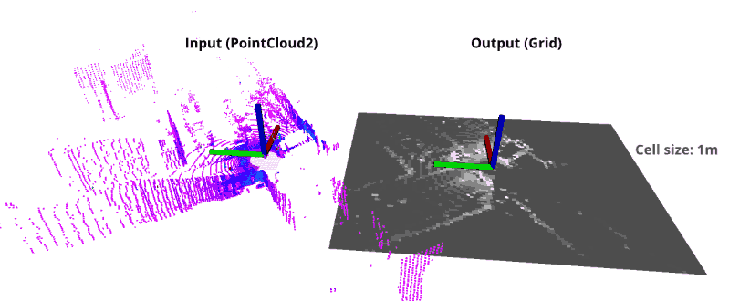
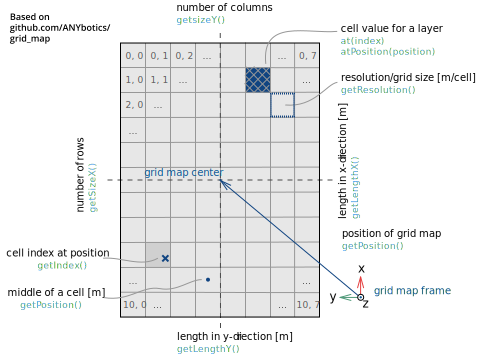

# `pointcloud_to_grid` ROS package
This package converts `sensor_msgs/PointCloud2` LIDAR data to `nav_msgs/OccupancyGrid` 2D map data based on intensity and / or height.


## Build
```
cd ~/catkin_ws/src 
git clone https://github.com/jkk-research/pointcloud_to_grid
catkin build pointcloud_to_grid
```
Don't foget to `source ~/catkin_ws/devel/setup.bash`. *Note*: [`catkin tools`](https://catkin-tools.readthedocs.io/en/latest/verbs/catkin_build.html) is recommended, but `catkin_make` also works.


## Features
- Few dependencies (ROS and PCL mainly) [ROS installation](http://wiki.ros.org/ROS/Installation)
- Simple as possible
- Fast

## Conventions & definitions


# Getting started

Issue the following commands to start roscore, download and play sample data, and start the algorithm with visualization.

In a **new terminal** start roscore:

```
roscore
```

In a **new terminal** go to your bag folder (e.g. `~/Downloads`):

```
cd ~/Downloads
```

Download a sample rosbag (~3,3 GB):

```r
wget https://laesze-my.sharepoint.com/:u:/g/personal/herno_o365_sze_hu/EYl_ahy5pgBBhNHt5ZkiBikBoy_j_x95E96rDtTsxueB_A?download=1 -O leaf-2021-04-23-campus.bag
```

Play rosbag:

```r
rosbag play -l ~/Downloads/leaf-2021-04-23-campus.bag
```

Start the algorithm in a **new terminal** :
```r
roslaunch pointcloud_to_grid demo.launch
```

Start the visualization in a **new terminal** :
```r
roslaunch pointcloud_to_grid rviz.launch
```


## Related solutions
- [github.com/ANYbotics/grid_map](https://github.com/ANYbotics/grid_map) - This is a C++ library with ROS interface to manage two-dimensional grid maps with multiple data layers. 
- [github.com/306327680/PointCloud-to-grid-map](https://github.com/306327680/PointCloud-to-grid-map) - A similar solution but instead PointCloud2 it uses PointCloud


## Cite & paper

If you use any of this code please consider citing TODO:

```bibtex
```